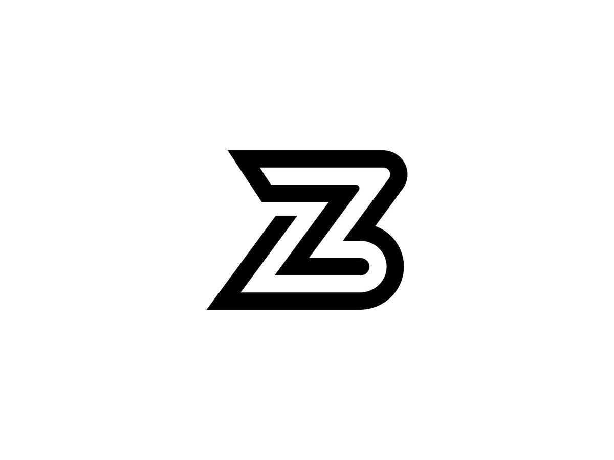

<html lang="en">
<head>
  <meta charset="UTF-8" />
  <meta name="viewport" content="width=device-width, initial-scale=1.0" />
  <title>BIGZSHOPX - Custom & Premade Outfits</title>
  <link href="https://fonts.googleapis.com/css2?family=Inter:wght@400;600;800&display=swap" rel="stylesheet">
  
</head>
<body>
  <header>
    <nav>
      
      <ul>
        <li><a href="#home">Home</a></li>
        <li><a href="#services">Outfits</a></li>
        <li><a href="#about">About</a></li>
        <li><a href="#contact">Contact</a></li>
      </ul>
    </nav>
  </header>

  <section id="home" class="hero">
    <h2>Style That Fits You</h2>
    
BIGZSHOPX offers trendy premade outfits and fully customizable clothing that makes you stand out.

    <a href="#contact" class="btn">Order Now</a>
  </section>

  <section id="services" class="section">
    <h2>Our Outfits</h2>
    

      

        <h3>Premade Outfits</h3>
        
Handpicked stylish fits, ready to wear and ship immediately.

      

      

        <h3>Custom Designs</h3>
        
Create your dream outfit with our design team. You choose, we make it happen.

      

      

        <h3>Group Orders</h3>
        
Perfect for teams, events, and crews. Bulk options available with personalized touches.

      

    

  </section>

  <section id="about" class="section">
    <h2>About BIGZSHOPX</h2>
    
Founded in 2025, BIGZSHOPX was built to bring creativity and identity to fashion. Whether you're after convenience or a fully custom look, we're here to deliver high-quality style at an affordable price.

  </section>

  <section id="contact" class="section">
    <h2>Contact Us</h2>
    
Have questions or ready to order? Reach out directly at <strong>bigzshopx@gmail.com</strong> or use the form below.

    <form>
      <input type="text" placeholder="Your Name" required />
      <input type="email" placeholder="Your Email" required />
      <textarea placeholder="Your Message" rows="5" required></textarea>
      <button type="submit">Send Message</button>
    </form>
  </section>

  <footer>
    
&copy; 2025 BIGZSHOPX. All rights reserved.

  </footer>
</body>
</html>
